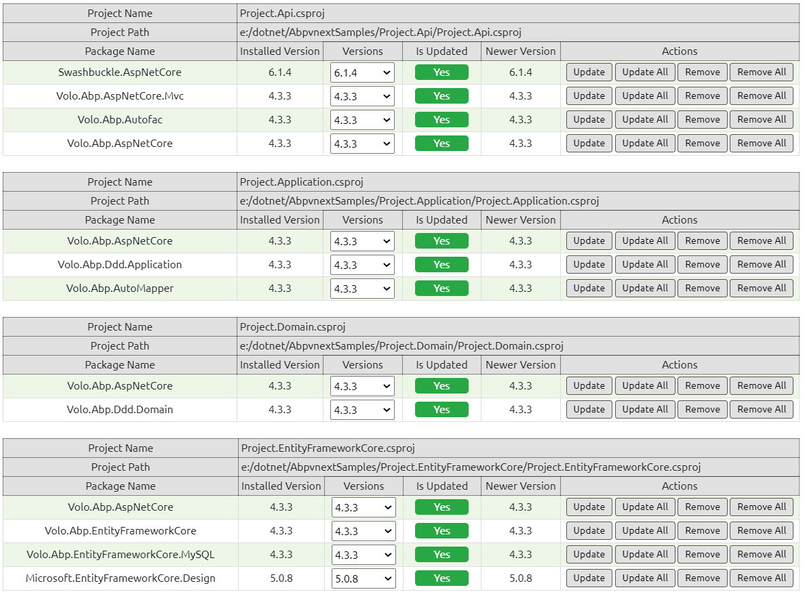

# 项目初始化

> TargetFramework: net5.0

- core web api
  - Project.Api
- class library
  - Project.Application
  - Project.Domain
  - Project.EntityFrameworkCore

# 安装依赖包



# 使用docker安装MySQL数据库

```sh
docker pull mysql

docker run --name project-mysql --restart=always -d \
-v project-mysqldata:/var/lib/mysql \
-e MYSQL_ROOT_PASSWORD=rootpwd \
-e MYSQL_DATABASE=project \
-e MYSQL_USER=projectuser \
-e MYSQL_PASSWORD=projectpwd \
-e TZ="Asia/Chongqing" \
-p 3306:3306 \
mysql:latest \
--character-set-server=utf8mb4 --collation-server=utf8mb4_unicode_ci

# 验证时区
docker exec -it project-mysql bash
mysql -uroot -prootpwd
select now();
show variables like '%time_zone%';
```

